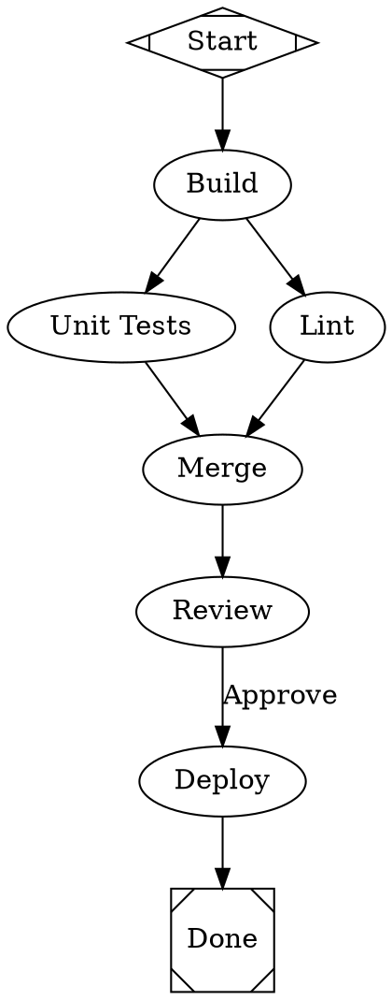

# needle

A DOT-graph pipeline runner. Define workflows as Graphviz DOT files, execute them with LLM and CLI backends, and monitor everything through a real-time web dashboard.

Needle parses DOT graphs where nodes represent pipeline stages (LLM calls, shell commands, human approvals, parallel branches) and edges represent control flow. It executes the graph, handles retries, checkpoints, and streams events via SSE to a browser-based dashboard.

## Quick start

```bash
# Build
mkdir build && cd build
cmake .. -DNEEDLE_BUILD_SERVER=ON
make -j$(nproc)

# Run with an existing pipeline
./needle serve sample_dots/simple_pipeline.dot
# Open http://localhost:8080

# Or try the interactive-chat template (opens a chat panel in the dashboard)
./needle serve sample_dots/interactive_chat.dot

# Or start with an empty workspace and build interactively
./needle serve
# The AI assistant in the Create view will help you design a pipeline
```

## Stage status

The engine writes a `status.json` for every executed stage under
`<run-dir>/stages/<node-id>/`. Beyond the basic outcome fields, two
diagnostic fields are populated automatically:

- `git_state` — commits added, files newly untracked, and files modified
  during the stage (relative to the stage's start). Surfaces salvageable
  partial work after a stage failure without manual `git status`
  archaeology.
- `timeout_kind` — `"wall_clock"` or `"idle"`, when `timed_out=true`.
  Distinguishes a stalled silent process from one that simply ran past
  its hard cap.

## Troubleshoot agent (v1: diagnose only)

Automates the manual triage step after a failed pipeline run. Reads a
run directory's checkpoint and stage status, classifies the failure
mode against a small catalogue of known patterns, and writes a
human-readable recovery report:

```
needle troubleshoot <run-dir>
```

The report goes to stdout and to `<run-dir>/recovery-<timestamp>.md`.

The classifier currently distinguishes six patterns: idle stall (with
uncommitted work / committed work / nothing to salvage), wall-clock
timeout with progress, self-exit error, and prompt blowup. v1 ships
diagnose-only — operators can apply checkpoint mutations by hand using
`needle stage mark` / `needle stage advance`. v2 (salvage commits) and
v3 (auto checkpoint advancement) are follow-ups.

## Per-node tool allow-lists

Non-coding stages (critique, write_pr, docs) need to be prevented from
modifying source even if a context-hijack convinces the agent to call
`Edit` or `Write`. The `allowed_tools` attribute pairs with the skill's
role-isolation prompt preamble (S7) for defence-in-depth:

```dot
critique [
    class="critique",
    allowed_tools="Read,Bash,Grep,Glob",   // explicit allow-list
    ...
]
```

Or via stylesheet:

```dot
graph [ model_stylesheet="
    .critique  { allowed_tools = \"Read,Bash,Grep,Glob\" }
    .write_pr  { allowed_tools = \"Read,Bash,Grep,Glob,Write:logs/pr/**\" }
" ]
```

For `claude`-routed nodes, the listed tools are passed via
`--allowedTools` and obvious file-modifying tools (Edit, Write,
NotebookEdit) are explicitly disallowed unless they appear in the
allow-list. For `codex` and `gemini`, allow-list enforcement is left
to the prompt preamble in v1.

Path-scoped writes (`Write:<glob>`) are recognised but currently
translated to bare `Write` with a logged note — full glob enforcement
is a follow-up.

## Soft graph-hash check on resume

`needle resume` no longer fails simply because the DOT was edited mid-run.
The validator records each completed node's per-node hash on the
checkpoint and uses it to distinguish two cases on hash mismatch:

- All completed nodes' hashes match the current graph: warn quietly
  ("only unstarted nodes affected") and continue. Mid-run timeout bumps
  and prompt edits to upcoming nodes work without `graph_hash`
  surgery.
- A completed node's hash has changed: warn loudly with the node id.
  Pass `--strict-graph-hash` (or set `strict_hash_check=true` on the
  graph attrs) to escalate to an error that blocks resume.

## Manual stage management

When an operator hand-finishes a stage (after debugging, manual recovery,
or the troubleshoot agent applying a fix), two CLI verbs replace the
five-edit checkpoint dance:

```
needle stage mark <run-dir> <node-id> <success|failure> [--output "summary"]
needle stage advance <run-dir> --to <node-id>
```

`mark` updates `completed_nodes`, `context["codergen.<node-id>.output"]`,
`context["needle.last_outcome.status"]`, `current_node`, and the stage's
`status.json` atomically. `advance` sets `current_node` so a subsequent
`needle resume <run-dir>` continues from the chosen target.

The graph-aware "what's next from here" lookup belongs to the
troubleshoot agent (Sprint 6+); for now, `advance` requires `--to`.

## Prompt-size guards

Codergen prompts grow over a multi-phase pipeline as upstream context
gets pulled forward. A prompt much larger than 100 KB almost always
indicates a misshapen DOT (typically `fidelity="full"` carrying verify
output through every phase) and is worth aborting before burning a full
attempt.

needle warns at 100 KB and hard-fails at 500 KB by default. Tune via the
user config:

```
needle config set defaults.prompt_warn_kb 75
needle config set defaults.prompt_fail_kb 300
```

Set either to `0` to disable.

## Commands

```
needle run <graph.dot>           Run a pipeline to completion
needle serve [graph.dot]         Start HTTP server with web dashboard
needle validate <graph.dot>      Validate a graph without running
needle resume <checkpoint.json>  Resume from a checkpoint
needle retry <node>              Reset checkpoint to before a node and resume
needle config [get|set|list]     Manage configuration
needle auth                      Validate API keys
needle status                    Show pipeline status from checkpoint
```

**Note on resume behavior**: When resuming from a checkpoint, retry budgets are
intentionally reset. Each node gets a fresh retry allowance, regardless of how
many retries were consumed in the prior run. This gives the pipeline a clean
chance to succeed after transient failures.

### Options

```
--port PORT           HTTP server port (default: 8080)
--bind ADDR           Bind address (default: 127.0.0.1)
--logs-dir DIR        Directory for run logs and checkpoints
--project-dir DIR     Project working directory (default: cwd)
--stylesheet FILE     NSS stylesheet file for model routing
--backend cli|llmkit  Backend to use (default: cli)
--var key=value       Set a context variable (repeatable)
--dry-run             Use no-op handlers (validate only)
--debug               Enable debug/trace logging
--json                Output events as JSON lines on stdout
--no-color            Disable colored output
```

### Model stylesheet

Route nodes to different agents and models using CSS-like rules in a `model_stylesheet` graph attribute or external `.nss` file:

```dot
graph [model_stylesheet="
    * { agent = \"codex\"; llm_model = \"gpt-5.4\" }
    .planning { agent = \"claude\"; llm_model = \"claude-opus-4-7\"; reasoning_effort = \"high\" }
    .coding { agent = \"codex\"; llm_model = \"gpt-5.4\" }
    .critique { agent = \"gemini\"; llm_model = \"gemini-2.5-pro\" }
"]
```

The `agent` property selects the CLI tool (claude, codex, gemini). `llm_provider` is accepted as an alias. Default values come from your configured model defaults (`needle config`).

Selectors by specificity: `*` (all) < `.class` < `#node_id`. Node-level attributes override stylesheet rules.

## Pipeline definition

Pipelines are Graphviz DOT digraphs. Each node has a `type` attribute that determines how it executes:

| Type | Description |
|------|-------------|
| `start` | Entry point (exactly one per graph) |
| `exit` | Termination (exactly one per graph) |
| `codergen` | Runs an external CLI tool (code generation, builds) |
| `llmkit` | Calls an LLM provider directly |
| `tool` | Executes a shell command |
| `conditional` | Branches based on edge conditions |
| `parallel` | Fan-out: all outgoing edges execute concurrently |
| `fan_in` | Synchronization point for parallel branches |
| `wait_human` | Pauses for human input or approval |
| `manager_loop` | Iterative loop with a goal gate |
| `interactive` | Multi-turn human-AI collaborative chat |
| `nested_run` | Execute a sub-pipeline |
| `doc_fetch` | Fetch and extract content from URLs |
| `web_search` | Web search via configured provider |

### Node attributes

- `label` — display name
- `type` — node type (inferred from shape if not set)
- `prompt` — prompt text for `llmkit` and `codergen` nodes
- `agent` — CLI agent: `"claude"`, `"codex"`, or `"gemini"` (alias: `llm_provider`)
- `llm_model` — model name override
- `class` — for model stylesheet targeting (e.g., `"planning"`, `"coding"`, `"critique"`)
- `command` — shell command for `tool` nodes
- `timeout` — wall-clock max execution time, e.g. `"90m"`, `"30s"`. Codergen nodes default to the template's 45m; tool nodes default to 60s.
- `idle_timeout` — kill the wrapped process if no stdout/stderr arrives for this duration. Codergen template default is 5 minutes; tool nodes default to disabled (`0`). Set `idle_timeout="0"` per-node to disable.
- `goal_gate` — `"true"` for `manager_loop` exit condition
- `max_iterations` — max loop count for `manager_loop`

Graph-level `node [timeout="90m", idle_timeout="6m"]` declarations propagate to every node (declared, edge-only-referenced, or otherwise). Per-node attrs override the graph default. When a process is killed, the stage status's `timeout_kind` field distinguishes `wall_clock` (total elapsed exceeded `timeout`) from `idle` (no output for `idle_timeout`).

### Edge attributes

- `label` — display label
- `condition` — condition expression (e.g., `outcome=success`)

### Example



## Web dashboard

The dashboard is served at `http://localhost:8080` when running `needle serve`. It is a single-page app with no external build system — all HTML, CSS, and JS are embedded in the binary.

### Views

- **Dashboard** — stats cards (total/running/completed/failed), run grid with status badges and progress bars
- **Monitor** — stage list with expandable logs, SVG graph with real-time node status coloring, zoom controls, tab bar for multiple runs
- **Create** — AI assistant chat for building pipelines from natural language, DOT editor with live graph preview, file upload, template loading
- **Settings** — API keys with validation, agent/model defaults (coding, planning, critique, chat), dark/light theme, gate sound, logging level
- **Logs** — pipeline event log (node started/completed/failed) and needle system log (`~/.needle/needle.log`), both with live updates and auto-scroll

### AI assistant

The Create view includes an AI-powered pipeline builder. Describe what you want in plain language and the assistant generates valid DOT:

1. Set your API key: `export ANTHROPIC_API_KEY=sk-...` (or `OPENAI_API_KEY` / `GEMINI_API_KEY`)
2. Run `needle serve`
3. Open the Create view, type a description, and click Send
4. The assistant generates DOT source, which populates the editor and updates the graph preview
5. Iterate: "add a retry step", "make the tests run in parallel", etc.
6. Click "Run Pipeline" to execute

### Real-time updates

- SSE event stream at `/api/v1/events` multiplexes events from all runs
- Automatic reconnection with exponential backoff
- SVG node coloring updates via CSS classes (no page refresh)
- Toast notifications on run completion/failure
- Dashboard API requests use relative paths (via `apiUrl()` helper) so the UI works behind reverse proxies
- Interactive chat sessions are persisted incrementally to `chat_history.json` — reconnecting after a disconnect restores the conversation

## API

All endpoints under `/api/v1/`.

| Method | Path | Description |
|--------|------|-------------|
| `GET` | `/` | Dashboard HTML |
| `GET` | `/api/v1/status` | Server metadata (graph name, node/edge count, active runs) |
| `GET` | `/api/v1/runs` | List all runs (includes CLI-started runs from `runs.json`) |
| `GET` | `/api/v1/runs/{id}` | Single run detail |
| `POST` | `/api/v1/runs` | Start a run (optional `dot_source`, `project_dir`, `vars`) |
| `POST` | `/api/v1/resume` | Resume from checkpoint (`project_dir`, `dot_stem`, optional `replace_run_id`) |
| `POST` | `/api/v1/runs/{id}/cancel` | Cancel a run |
| `DELETE` | `/api/v1/runs/{id}` | Delete a run (optional `?artifacts=true`) |
| `POST` | `/api/v1/runs/{id}/answer` | Submit human gate answer |
| `POST` | `/api/v1/runs/{id}/continue` | Continue interactive/gated run |
| `GET` | `/api/v1/stages/{node_id}` | Stage detail (prompt, response, status) |
| `GET` | `/api/v1/graph/svg` | Startup graph as SVG |
| `GET` | `/api/v1/graph/dot` | Startup graph as DOT |
| `POST` | `/api/v1/render-dot` | Render DOT source to SVG |
| `POST` | `/api/v1/generate-dot` | AI pipeline generation (send `{provider, messages}`) |
| `GET` | `/api/v1/events` | Global SSE event stream |
| `GET` | `/api/v1/logs/needle` | Tail needle log file (`?offset=N` for incremental) |
| `GET` | `/api/v1/config` | Read configuration |
| `POST` | `/api/v1/config` | Update configuration values |
| `POST` | `/api/v1/config/validate-key` | Validate a provider API key |
| `GET` | `/api/v1/models/{provider}` | List available models for a provider |
| `POST` | `/api/v1/check-checkpoint` | Check if checkpoint exists for a project/DOT |
| `POST` | `/api/v1/pause` | Pause all running pipelines |
| `POST` | `/api/v1/pause/resume` | Resume paused pipelines |

## Building

### Requirements

- C++14 compiler (GCC 5+, Clang 3.4+, MSVC 2015+)
- CMake 3.10+
- pthreads

### Optional dependencies

| Dependency | Purpose | Fallback |
|------------|---------|----------|
| libcurl | LLM API calls (`llmkit` nodes, AI assistant) | LLM features disabled |
| Graphviz `dot` binary | SVG graph rendering in Monitor view | Textual stage list only |
| Python 3 | Regenerating dashboard assets from source | Use committed generated file |

### Bundled (in `third_party/`)

- [cpp-httplib](https://github.com/yhirose/cpp-httplib) — HTTP server
- [nlohmann/json](https://github.com/nlohmann/json) — JSON parsing
- [Catch2](https://github.com/catchorg/Catch2) v2 — testing

### Build options

```bash
cmake .. \
  -DNEEDLE_BUILD_SERVER=ON   \  # HTTP server and dashboard (default: ON)
  -DNEEDLE_BUILD_TESTS=ON    \  # Test suite (default: ON)
  -DNEEDLE_ASAN=ON           \  # AddressSanitizer
  -DNEEDLE_TSAN=ON              # ThreadSanitizer
```

### Asset pipeline

Dashboard source files live in `src/server/assets/` as standalone HTML, CSS, and JS. The embed script converts them to C++ string constants:

```bash
python3 scripts/embed_html.py
```

The generated `src/server/dashboard_html.cpp` is committed to the repo, so Python is not a build dependency. CMake regenerates it automatically if Python 3 is available and asset files change.

## Testing

```bash
cd build
./needle_tests                    # Run all tests
./needle_tests "[graph_serializer]"  # Run specific tag
./needle_tests "[dashboard]"         # Dashboard endpoint tests
```

## LLM providers

### CLI backend (codergen nodes)

The CLI backend dispatches to local CLI tools. The `agent` node attribute (or stylesheet) selects the template:

| Agent | CLI tool | Default model | Prompt delivery |
|-------|----------|---------------|-----------------|
| `claude` | `claude` | claude-opus-4-7 | stdin |
| `codex` | `codex` | gpt-5.4 | stdin |
| `gemini` | `gemini` | gemini-2.5-pro | stdin via `-p` |

Configure defaults via `needle config set defaults.coding_agent codex` etc., or in the dashboard Settings.

### LLMKit backend (llmkit nodes)

Direct HTTP API calls. Set the appropriate environment variable:

| Provider | Environment variable | Default model |
|----------|---------------------|---------------|
| Anthropic | `ANTHROPIC_API_KEY` | claude-sonnet-4-20250514 |
| OpenAI | `OPENAI_API_KEY` | gpt-4o |
| Google | `GEMINI_API_KEY` | gemini-2.5-flash |

### Web search provider

The `web_search` handler uses Tavily:

| Provider | Environment variable |
|----------|---------------------|
| `tavily` | `TAVILY_API_KEY` |

All keys can also be set via `needle config set providers.<name>.api_key <key>` or the dashboard Settings UI.

## JSON event output

Pass `--json` to emit pipeline events as JSON lines on stdout (one event per
line). Useful for scripting, CI, or piping into another process:

```bash
needle run --json pipeline.dot | jq 'select(.type == "node.complete")'
```

Events include `node.transition`, `node.complete`, `gate.waiting`, and the
usual lifecycle signals.

## Architecture

```
include/needle/
  model/         Graph, Node, Edge, Context, AttributeMap
  parser/        DOT lexer, parser, graph builder
  validation/    Graph validation rules
  engine/        Pipeline engine, edge selection, checkpoints, retry
  handlers/      Node type handlers (start, exit, codergen, llmkit, ...)
  backend/       LLM and CLI backends
  interviewer/   Human interaction (console, HTTP, auto-approve)
  event/         Event types, bus, collector
  server/        HTTP server, dashboard, DOT generator
  util/          Helpers (graph serializer, fs helpers, run registry, logger)

src/             Implementation files matching the header structure
scripts/         embed_html.py (asset pipeline)
tests/           Unit and integration tests
third_party/     Bundled dependencies
sample_dots/     Example pipeline definitions
```

## License

Apache License 2.0. See [LICENSE](LICENSE) and [NOTICE](NOTICE) for bundled
third-party licenses.

